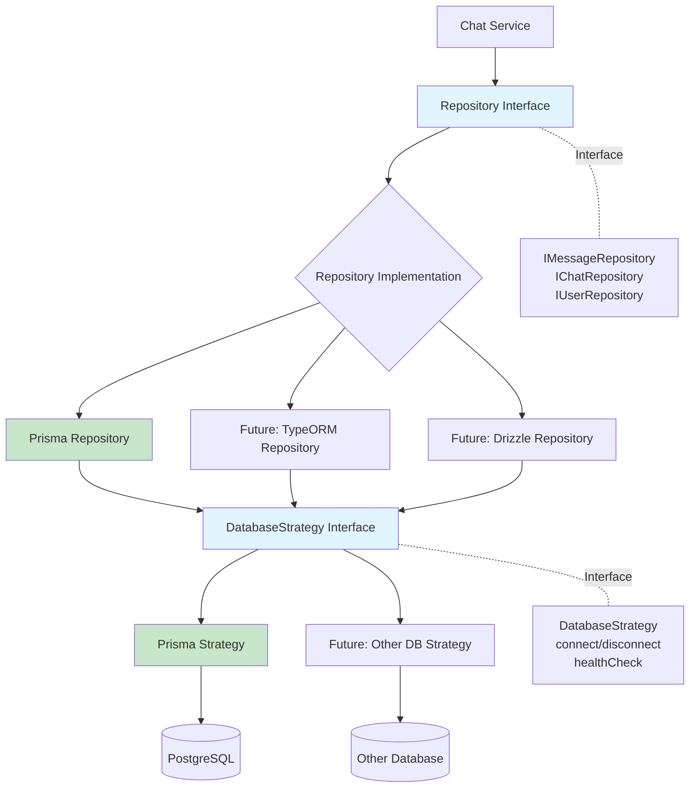
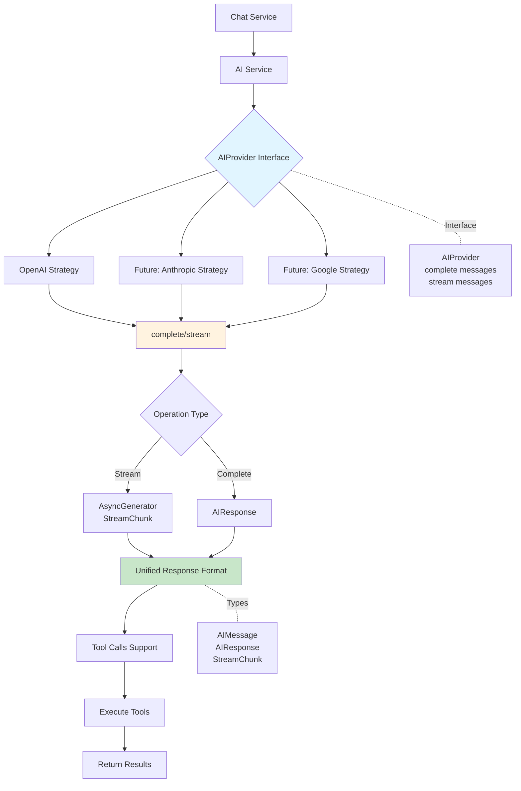
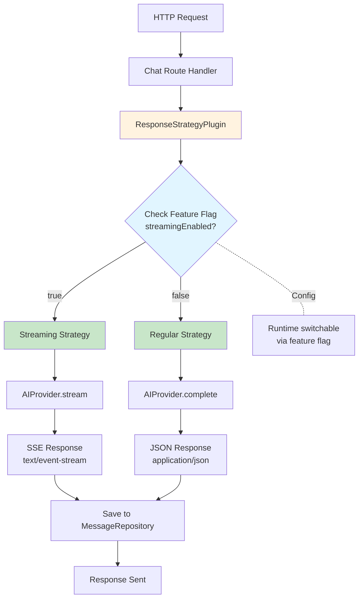
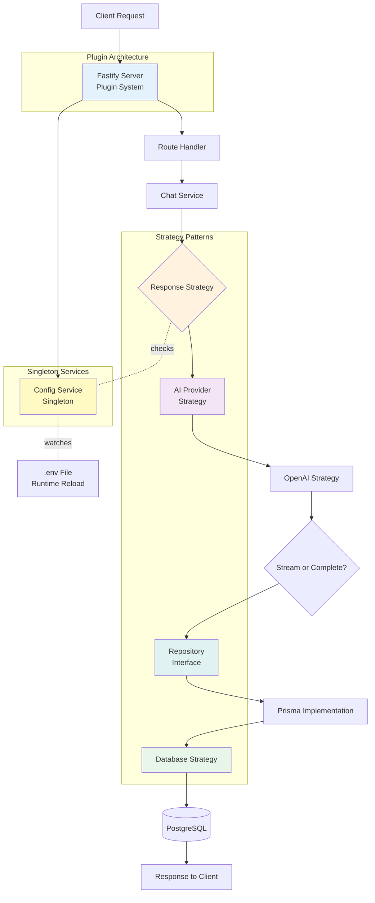

# Architecture Decision Record

## Overview
This document captures key architectural decisions for the LLM Chat Engine, emphasizing simplicity, flexibility, and runtime adaptability.

---

## 1. Plugin-Based Architecture with Fastify

**Decision:** Use Fastify's functional plugin system for application composition

**Context:**
- Need lightweight dependency injection
- Must control plugin load order
- Want low memory footprint

**Implementation:** `src/server.ts`
- Plugins registered in dependency order
- Singleton pattern via Fastify's plugin system
- Basic DI through plugin decorators

**Benefits:**
- Explicit dependency chain
- Minimal overhead
- Clear initialization order

---

## 2. Strategy Pattern for Database Layer

**Decision:** Abstract database operations behind strategy interfaces

**Context:**
- Potential ORM migrations in future
- Need decoupling from specific database implementation

**Implementation:** 
- `src/services/database/database.strategy.ts` - Core strategy interface
- `src/repositories/` - Repository layer using strategy pattern

**Benefits:**
- Flexibility to swap ORMs without business logic changes
- Clean separation of concerns
- Testability through interface abstraction

**Flow:**

**Example:**
- Service calls `IMessageRepository.create()`
- Implementation is `PrismaMessageRepository`
- Uses `DatabaseStrategy` for connection management
- Swapping to TypeORM only requires new implementation, no service changes

---

## 3. AI Provider Strategy Pattern

**Decision:** Abstract AI provider implementations behind common interface

**Context:**
- Support multiple AI providers (OpenAI, Anthropic, etc.)
- Each provider has different APIs and capabilities
- Need consistent interface for business logic

**Implementation:** `src/services/ai/ai.types.ts`
- `AIProvider` interface with `complete()` and `stream()` methods
- Provider-specific strategies in `src/services/ai/strategies/`
- Tool calling abstraction

**Benefits:**
- Switch AI providers without changing business logic
- Support multiple providers simultaneously
- Consistent error handling and response format

**Flow:**

**Example:**
- Service calls `aiProvider.stream(messages)`
- Currently using `OpenAIStrategy`
- Returns standardized `StreamChunk` objects
- Switching to Anthropic only requires new strategy implementation
- Consumer code unchanged

---

## 4. Response Strategy Pattern for AI Outputs

**Decision:** Use strategy pattern for different AI response formats

**Context:**
- Multiple output formats needed (streaming, JSON, SSE)
- AI providers may return different response structures

**Benefits:**
- Single interface for multiple response types
- Easy to add new response formats
- Consumer code remains unchanged

**Flow:**

**Example:**
- Request arrives for chat completion
- `ResponseStrategyPlugin` checks `streamingEnabled` flag
- If enabled: uses streaming strategy → SSE response
- If disabled: uses regular strategy → JSON response
- Same AI provider interface, different response handling

---

## 5. Runtime Configuration Management

**Decision:** Implement hot-reload for feature flags via file watching

**Context:**
- Need runtime feature flag switching for demos/testing
- Want to show dynamic configuration capabilities

**Implementation:** `src/config/config.service.ts`
- Singleton ConfigService
- `.env` file watcher with debounced reload
- Feature flags, environment variables, and constants in one place

**Trade-offs:**
- ⚠️ Not production-recommended (acknowledged)
- ✓ Demonstrates runtime feature toggling
- ✓ Useful for development and demos
- ✓ Zero deployment needed for config changes

---

## Complete Request Flow

**All patterns working together:**

**Key Interactions:**
1. **Request** → Fastify handles via plugin system
2. **Config** → Provides feature flags and settings (runtime reloadable)
3. **Response Strategy** → Selects streaming or regular based on config
4. **AI Provider** → Executes AI call via provider strategy
5. **Repository** → Saves data via database strategy
6. **Response** → Returns to client in selected format

---

## Guiding Principles

1. **Simplicity First** - No over-engineering
2. **Strategic Flexibility** - Abstract where future changes are likely
3. **Explicit Dependencies** - Clear load order and relationships
4. **Runtime Adaptability** - Configure without redeployment where beneficial
